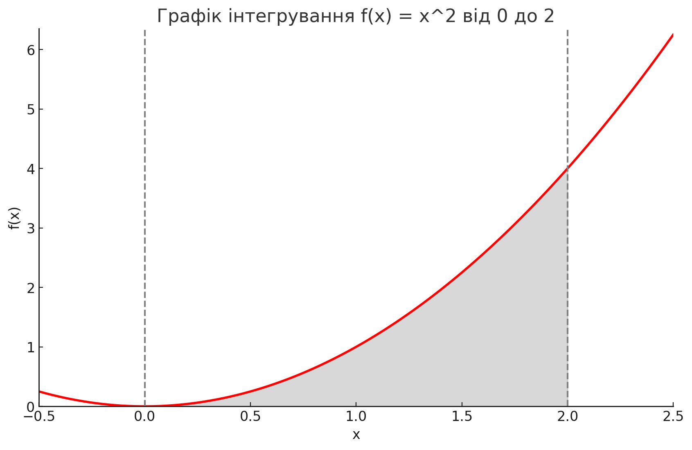

The results for the definite integral of
𝑓
(
𝑥
)
=
𝑥
2
f(x)=x
2
from
𝑎
=
0
a=0 to
𝑏
=
2
b=2 are as follows:

Monte Carlo Integration Result: ~2.63

Analytical Integration Result (using quad): 2.67

Estimated Error from quad: ~
2.96
×
1
0
−
14
2.96×10
−14

Analysis:
The Monte Carlo estimate is very close to the analytical result (2.67), demonstrating that the Monte Carlo method provides a good approximation of the integral. The small difference is expected due to the random sampling nature of the Monte Carlo approach and can be reduced by increasing the number of samples. The quad method provides an accurate analytical solution with a negligible error margin.

This comparison shows the Monte Carlo method's practicality for approximating definite integrals, particularly when the function is complex or multidimensional, and exact integration is challenging.